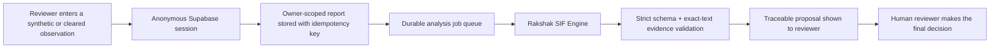
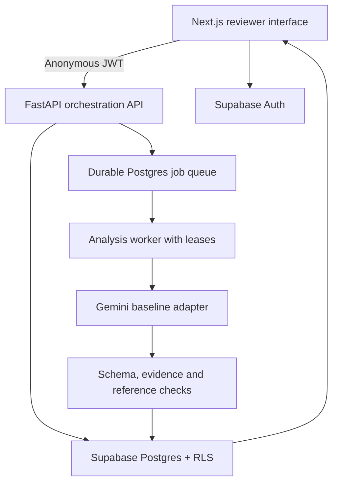

# Rakshak AI

Evidence-grounded review of near-miss and unsafe-condition reports for the
SIH 2026 problem statement SIH26165.

## Project links

- **Live prototype:** `ADD_DEPLOYED_URL`
- **Video walkthrough:** `ADD_VIDEO_URL`
- **GitHub:** https://github.com/harshit-164/Rakshak-AI

Rakshak AI helps a human reviewer inspect a safety observation for potential
serious injury or fatality (SIF) mechanisms. It is a decision-support tool:
it preserves the submitted text, proposes a structured assessment, and makes
the supporting exact-text evidence visible. It never certifies that work is
safe or replaces a competent safety reviewer.

## The problem

Safety observations often arrive as unstructured text. Reviewers must identify
hazardous energy, exposure, control status, and Life-Saving Rule context without
turning missing information into a confident conclusion.

Rakshak turns each report into a review proposal with a three-state SIF label
(`yes`, `no`, or `unknown`), exact-text evidence, barrier observations, rule
coverage, and visible model provenance. A qualified reviewer makes the final
decision.

## Demo flow



## Current architecture



The product layer is called the **Rakshak SIF Engine**. The prototype currently
uses Gemini behind that layer. Provider identity and configuration remain in
backend provenance records.

## Key capabilities

- One-click anonymous demo access with isolated, owner-scoped reports.
- Synthetic-content gate to prevent accidental submission of confidential data.
- Exact submitted narrative retained separately from normalization metadata.
- Idempotent report and analysis creation, quotas, durable jobs, and worker leases.
- Structured SIF label (`yes`, `no`, or `unknown`), barrier observations, and Life-Saving Rule context.
- Strict validation: every quoted item must be present in the supplied narrative or activity.
- Versioned prompt, reference-bundle, rubric, and assessment provenance.

## Model status

The live prototype currently uses a hosted Gemini baseline behind the
**Rakshak SIF Engine** product layer. The UI intentionally presents the
product engine rather than the provider name; the backend provenance retains
the actual configured model identity for auditability.

The model behaviour is adapted for this domain using a versioned SIF rubric,
canonical Life-Saving Rule taxonomy, controlled reference bundle, strict JSON
contract, and evidence-grounding validator. This is not represented as
fine-tuning.

The planned training track is:

1. A **DeBERTa-v3-small** supervised classifier for SIF and multi-label rule assessment.
2. A **Qwen 2.5 1.5B QLoRA** experiment for structured assessment generation.
3. Frozen held-out evaluation, model cards, threshold selection, and CPU reload checks before any trained artifact can replace the hosted baseline.

The repository does not claim that these models are already trained. Training
data rights and extraction status are tracked in
[`configs/references/source-register.v1.json`](configs/references/source-register.v1.json).

## Repository map

| Path | Purpose |
| --- | --- |
| `apps/web` | Next.js product UI and authenticated backend proxy |
| `services/api` | FastAPI routes, auth verification, persistence, worker, adapters |
| `supabase/migrations` | Postgres schema, RLS, queue and quota functions |
| `packages/contracts` | Shared API contracts generated from the backend |
| `configs` | Versioned prompts, references, and rate limits |
| `tests`, `supabase/tests`, `services/api/tests` | Isolation, contract, API, worker, and adapter verification |
| `data`, `evidence` | Draft extractions and task evidence used during prototype development |

## Run locally

### Prerequisites

- Node.js 20.9+
- Python 3.12–3.14 with `uv`
- A Supabase test project with **Anonymous sign-ins** enabled
- A Gemini API key for the hosted baseline

```bash
cp .env.example .env.local
cp apps/web/.env.example apps/web/.env.local
npm ci
uv sync --project services/api --all-groups
npm run dev
npm run api:dev
```

Open `http://localhost:3000`. API health is at
`http://localhost:8000/health/ready`.

Set `NEXT_PUBLIC_SUPABASE_URL`, `NEXT_PUBLIC_SUPABASE_ANON_KEY`, and
`API_BASE_URL` in `apps/web/.env.local`; set the server-only Supabase and
Gemini variables in the root `.env.local`. Never put service-role or Gemini
keys in browser-exposed variables.

Apply Supabase migrations in filename order before testing:

```text
supabase/migrations/202609030001_core_schema.sql
supabase/migrations/202609030002_queue_functions.sql
supabase/migrations/202609030003_atomic_demo_quotas.sql
```

## Verify

```bash
npm run test --workspace=@sih/web
cd services/api && .venv/bin/pytest tests
cd ../..
npm run db:test
npm run build --workspace=@sih/web
```

## Deployment

The repository includes a Vercel configuration for the web application and a
Render Blueprint for the single-worker API. Configure environment variables in
the respective deployment dashboards, apply migrations to the test Supabase
project, and set `ALLOWED_ORIGINS` to the deployed web origin.

## Safety and privacy

Use only synthetic or cleared public content in the demo. Reports are private
to the anonymous browser session that created them. Rakshak proposes an
assessment; operational safety decisions remain with qualified humans.
